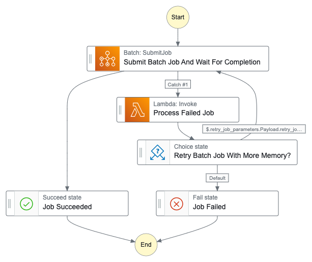

# AWS Batch memory auto-scaling with Step Functions

This is a sample implementation for running an AWS Batch job that automatically scales up required memory using the Serverless framework.s
To achieve this, a simple AWS Step Function state machine is used to orchestrate the job running process. An AWS Lambda is used to process failed jobs. When the job failure is due to a Memory Error , it then creates a job specification with more memory available and the job is executed again.

All components are serverless keeping the cost down for some scenarios like Data Science pipelines and ETL/ELT pipelines.

This example also show how to run multiple jobs on different schedules. This relies on AWS EventBridge Rules, so keep in mind currently there is a limit of 300 Rules per Bus (which can be increased).

Here is a representation of the state machine:


In addition to Step Function and Lambdas, other CloudFormation resources are created as part of this implementation (under `resources.yml`):
- Step Functions IAM Role
- Batch Compute Environment
- Batch Job Queue
- Batch Job Definition

## Getting started

1. Install the [serverless](https://www.serverless.com/framework/docs/getting-started) framework
2. Install the required serverless plugins:
```bash
> serverless plugin install -n serverless-step-functions
✔ Plugin "serverless-step-functions" installed  (17s)
````
3. Choose a subnet and security group, then deploy a new stack:
```bash
> sls deploy --param="subnet_id=subnet-12345678" --param="security_group_id=sg-12345678"
Running "serverless" from node_modules

Deploying memory-autoscaling-example to stage dev (us-east-1)
✓ State machine "JobRunner" definition is valid

✔ Service deployed to stack memory-autoscaling-example-dev (162s)

functions:
  processFailedBatchJob: memory-autoscaling-example-dev-processFailedBatchJob (137 kB)
```
4. Retrieve the ARN of the state machine and start a manual state machine execution (can also be done from AWS Management Console):
```bash
> aws stepfunctions start-execution --state-machine-arn arn:aws:states:us-east-1:ACCOUNT_ID:stateMachine:JobRunnerStepFunctionsStateMachine-eB75gE2choxG --input "{
  \"job_name\": \"bonjour\",
  \"job_vcpus\": \"0.25\",
  \"job_memory\": \"512\",
  \"job_command\": [
    \"echo\",
    \"bonjour\"
  ]
}"
{
    "executionArn": "arn:aws:states:us-east-1:ACCOUNT_ID:execution:JobRunnerStepFunctionsStateMachine-eB75gE2choxG:6bb5676c-4fe0-4754-8eac-6cca606d1476",
    "startDate": 1702081624.749
}
```

## Add scheduled jobs

To schedule a new job to run automatically you need to add a new object to the end of the file `jobs.yml` with these required parameters:

```yaml
  - schedule:
      rate: rate(1 hour)
      input:
        job_name: the-aws-batch-job-name
        job_vcpus: "0.25"
        job_memory: "512"
        job_command: ["echo", "howdy"]
```

After that you just need to re-deploy the changes using serverless.
